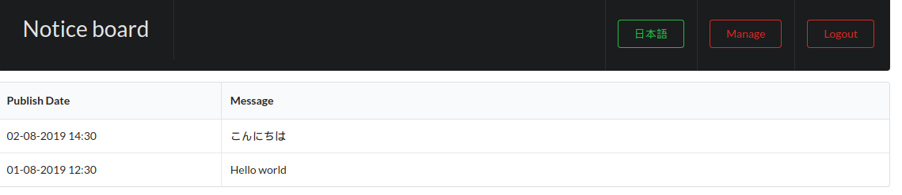
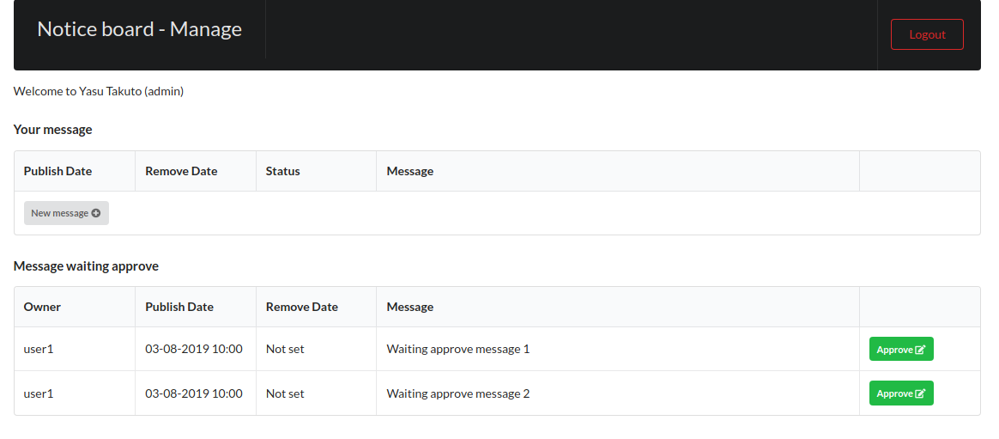
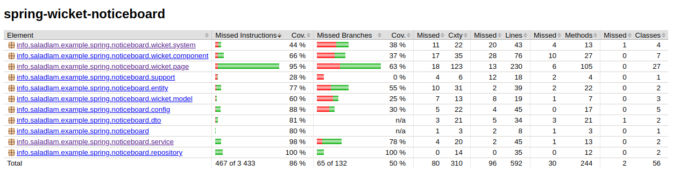

# Apache WICKET with SPRING boot example application: notice board
Оригинальный проект [https://github.com/saladlam/spring-wicket-noticeboard](https://github.com/saladlam/spring-wicket-noticeboard)

## Objective
I am writing this application for studying Apache wicket MVC framework.

## Function
- Display notice on stated time
- Approval before display
- Multi language UI

## Main component used
- Apache Wicket 9.X.X
- Spring Boot 2.6.X
- Spring Security 5.3.X
- Spring JDBC 5.3.X
- Liquibase 4.5.X
- Dozer 5.5.X

## Database
Data stored in embedded H2 database. Schema and data is imported when application start and all data will be lost after application shutdown.

## Prerequisite
- Java SE Development Kit 11 or above
- Internet connection

## Compile and run
Apache Maven wrapper is included, no addition package manager is necessary.

### Compile (On Microsoft Windows)
```
mvnw package
```

### Run (On Microsoft Windows)
```
mvnw spring-boot:run
```
Press Ctrl+C to stop.

## Account
| Username | Password | Authorities |
|:-------- |:-------- |:----------- |
| user1    | user1    | USER        |
| user2    | user2    | USER        |
| admin    | admin    | USER, ADMIN |


### Java 11

````
export JAVA_HOME=/usr/lib/jvm/java-11-openjdk-amd64/
echo $JAVA_HOME
/usr/lib/jvm/java-11-openjdk-amd64/
````

### Запуск
```
./mvnw spring-boot:run
```

## Пользователи/пароли/роли
| Name | Password| Роль |
|:-------- |:-------- |:----------- |
| user1    | user1    | USER        |
| user2    | user2    | USER        |
| admin    | admin    | USER, ADMIN |


Проверить, что свободен порт 8080.

http://127.0.0.1:8080/

Экран входа:



Управление сообщениями:



### Тестирование

Подключен контроль покрытия тестами. Сделано с помощью [jacoco](https://www.jacoco.org/jacoco/). Отчет генерируется автоматически при прогоне тестов или:

````shell
./mvnw jacoco:report
````

Отчет в consumer/target/site/jacoco/index.html

